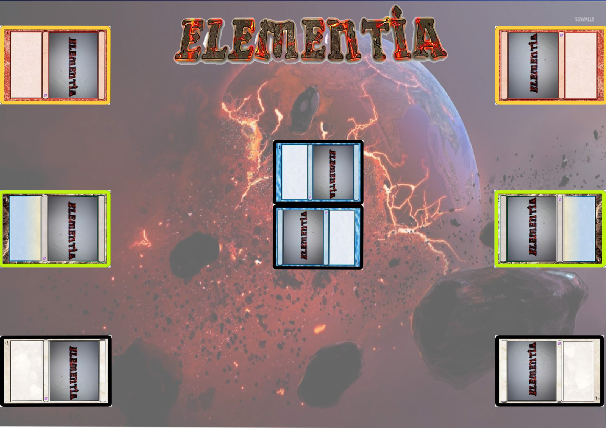
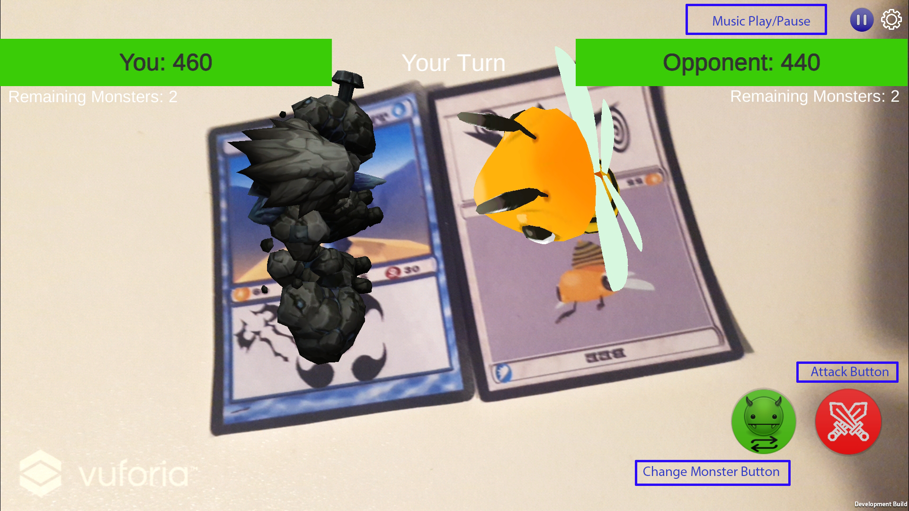

<p align="center">

</p>
<p align="center" >AR Fighting Game</p>


**TU Ilmenau - 2019 @ Germany**

### The Game Development project of the following Students: 

Programme: **Hong Ma**

Game Document/Logo:  **Cesar Quintero Arias**

Game Disign: **Sebastian Ribecky**

UI Elements: **Awais Khan**

-------------------------------------------------
### Demo

[Youtube](https://youtu.be/d4DMonYFu10)

------

### Before Playing

-   The **APK files is in "Build/Elementia.apk"**, for IOS u need to open Unity and switch the build platform
-   In order to play, you need to build this project with two different
    device, because it is a "multiplayer" game
-   The both device must connect to Internet
-   The `Start` button will be enabled, when both player has join the game (open the start menu)
-   This Game is tested with Samsung S7 Edge (Resolution aspect 16:9) 


### Rules


-   Each player has 8 monster cards at the beginning
-   Player need to chose 3 different cards(monsters) to fight.
-   Except first card, you should hide the left cards that don't let
    your opponent to konw that.
-   After choose, place your first picked card in front of your
    opponent.
-   You can change your card in the middle of a fight, just after the
    battle begins.
-   Each player can change his monsters maximal 2 times per battle.
-   You can only change your monster with one that you have already
    registered.
-   You cannot change a monster if it is the opponent’s turn or if you
    have already chosen to attack to the enemy.
    
### Play Board


<p align="center" >

</p>
<p align="center" >the both player can put his card on it</p>

### Fight Menu
<p align="center" >

</p>
<p align="center" >Red is Attack Button, and Green is the Change Monster Button</p>

### Monster Character

-   Fire Demon - fire
-   Dragon - fire
-   Wahl - water
-   Elf - water
-   Wizard - air
-   Bee - air
-   Skeleton - earth
-   Mouse - earth

### Element Relations


-   fire &lt; water
-   water &lt; earth
-   earth &lt; air
-   air &lt; fire

### Program Description
This game use Vofuria and PhotonNetworks frameworks.</br>
Because i can't send the defined class (like ElementiaPlayer, ElementiaMonster class) through Phton framework to the other player, so we must send ```string``` values from player one to the server, then player two will call the values from the photon cloud service, then the attribute, like HP and attack  will changed.


